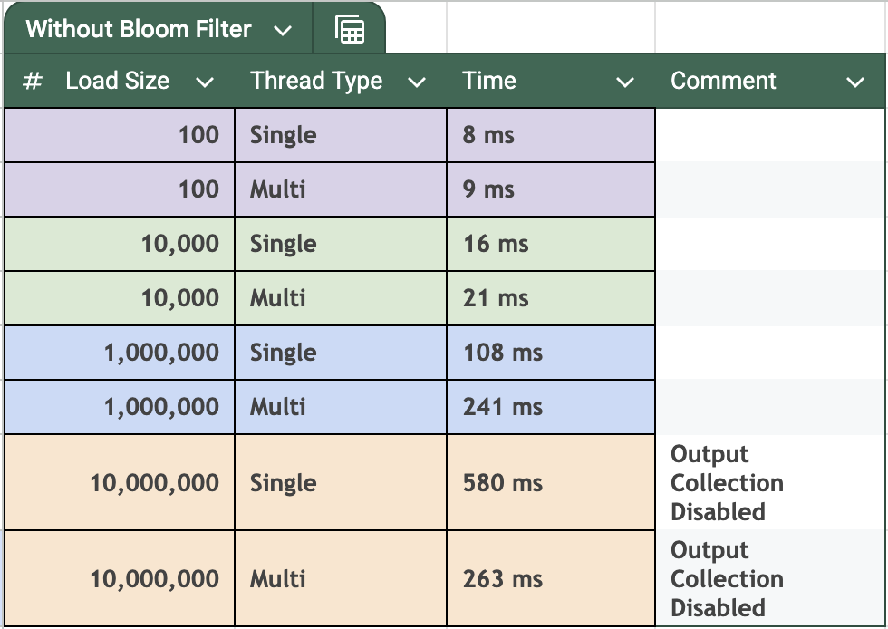

# Overview

This is a simple program that demonstrates the usage of concurrency in Java and usage of Bloom Filter to improve search performance.
The program generates a user-defined number of DNA sequences using both single threaded and multi-threaded approaches 
and compares the time taken to generate the sequences. 

Video Demo YouTube link: <TODO>

## How to run

1) Clone the repo: `git clone https://github.com/reazwrahman/concurrency-and-bloom-filter.git`
2) Build the program: `mvn clean install`
3) Run unit tests and generate coverage report: `mvn clean test`
4) Coverage report will be generated in `target/site/jacoco/index.html`
5) Run the program from an IDE (IntelliJ Preferred)

## Program Flow

1) Define the parameters in Configs.java including single vs multi-threaded, number of sequences, and whether to use a filter to generate unique sequences.
2) The program will generate DNA sequences using the specified approach and report the time and peak memory taken.

### ThreadHelper 
This class is responsible for generating DNA sequences using a single thread or multiple threads. 
For multithreading approach, I included three different ways to create those threads: using the Java Thread object,  
Executor Service with a runnable, and Executor Service with a callable returning a future object. 

### BloomFilter 
This class is responsible for generating a bloom filter from Google Guava Library, to store the DNA sequences.  
When the USE_FILTER flag is set to true in Configs.java, the program will use the bloom filter to generate all unique sequences.

I also enabled structured and unstructured (read-write) locks to have the filter working in a multi-threaded environment.

### Results 
I compared the performance between the single-threaded and multi-threaded approach first without using any filter and 
then with the filter. The results are shown below. 

Without using any filter, the single-threaded approach is faster than the multi-threaded approach for all batches of sequences.
I tried to investigate the reasons behind this and found that the overhead of creating threads and managing them is 
higher than the time saved by running them in parallel. 

The benefit of using multiple threads is more visible when the number of sequences is 10 million or higher and it becomes 
even more apparent when I disabled the writes to the synchronized output data structure. The overhead associated with locking
and unlocking this data structure with every interaction slows down the multihreaded appoach significantly. 

With using the filter, my main intention was to observe the peak memory used by the Bloom Filter. I observed the same behavior 
when it comes to time taken by the single and multi-threaded approach. 

### Time comparison (without using Bloom Filter)
  

### Time and Memory comparison (with Bloom filter) 
